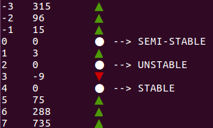

# Erez's diffyQ scripts

PROOF:
	1. DiffyQ is annoying
	2. I like to program
	3. This repo exists

## Getting Started

Just clone this repo and Run the scripts

### Eulers method

```bash
bash euler_method.sh
```


### Phase portrait

```bash
bash phase_portrait.sh
```

