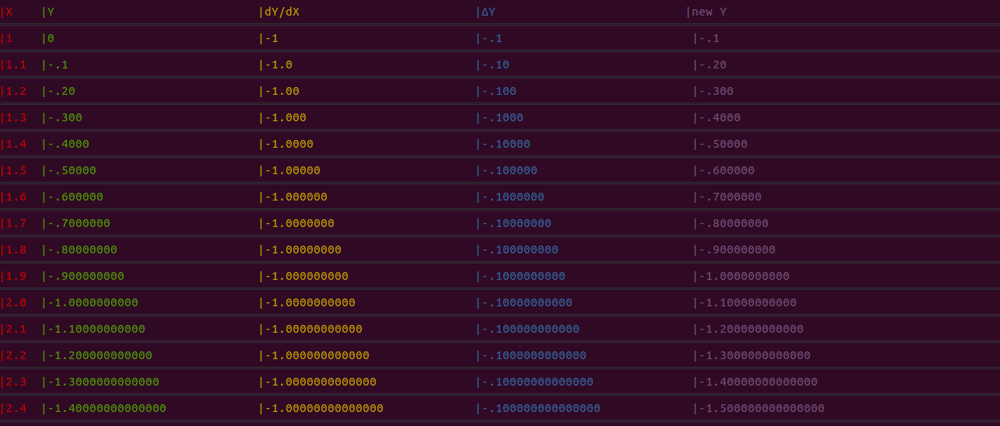

# Erez's math scripts

> ∀ _problems_ ∍ {_math problems_}  
>> _problems_ can often be annoying  
>> I like to program  
>> This repo exists                ∎  

### Eulers method  
```bash
bash euler_method.sh
```



### Phase portrait  
```bash
bash phase_portrait.sh
```

